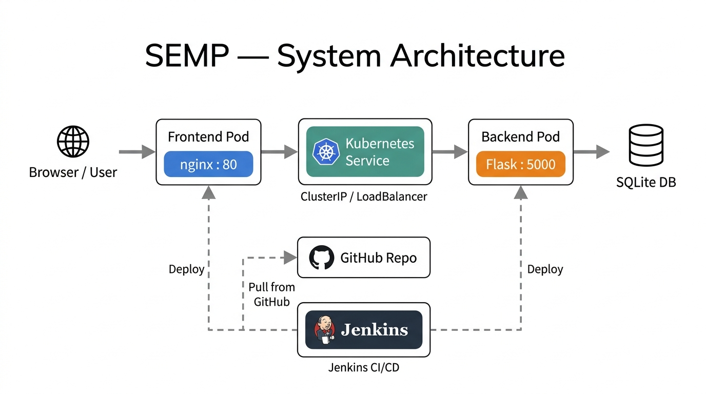
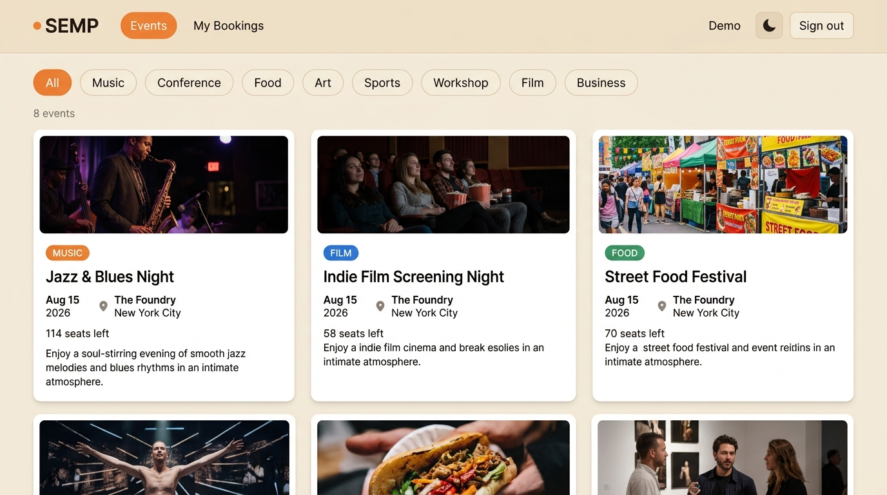
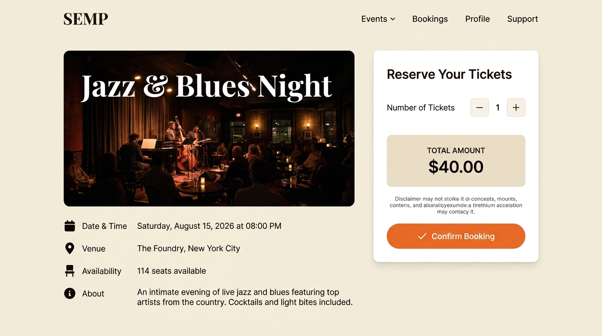
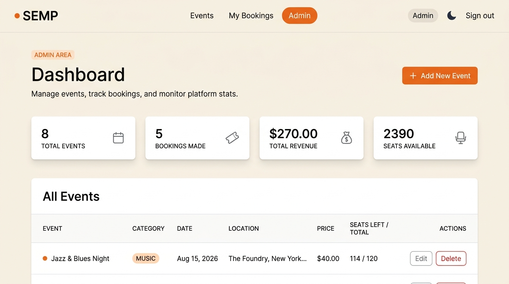

# 🎟️ Smart Event Management Portal (SEMP)

> A full-stack web platform for discovering, booking, and managing events — built with Flask, containerised with Docker, and deployed on Kubernetes.

<p align="center">
  
  
  
  
  
  
</p>

---

## Overview

Campus event discovery is often fragmented — scattered across notice boards, email lists, and social media. **SEMP** consolidates the entire lifecycle: users can explore upcoming events by category, reserve seats with real-time availability tracking, and review their booking history — all from a single, responsive interface.

On the operational side, administrators get a dedicated dashboard to create, update, and retire events without touching a database directly. The backend exposes a clean REST API, the frontend is served via nginx, and the entire stack is containerised and orchestrated with Kubernetes, making it production-deployable with a single manifest.

---

## Features

- 🔐 **Authentication** — Secure login and registration with session management; separate admin and user roles
- 🗓️ **Event Browsing** — Browse events filtered by category (Music, Tech, Food, Art, Film, Sports, Workshop, Business)
- 🎫 **Ticket Booking** — Reserve seats with quantity control, real-time pricing, and auto-generated booking references
- 📋 **Booking History** — Full log of past reservations with booking references and event details
- 🛠️ **Admin CRUD Dashboard** — Create, edit, and delete events; view platform-wide stats (revenue, seat count, booking totals)
- 🌙 **Dark Mode** — System-aware dark/light theme toggle persisted across sessions
- 🔍 **Live Search** — Client-side instant search filtering events by keyword as you type
- 📱 **Responsive Design** — Mobile-first layout that scales cleanly from 320 px to 4 K

---

## Tech Stack

| Layer | Technology |
|---|---|
| **Frontend** | HTML5, CSS3 (Vanilla), JavaScript (ES6+) |
| **Backend** | Python 3.9+, Flask 2.x |
| **Database** | SQLite (development) |
| **Web Server** | nginx (frontend container) |
| **Containerisation** | Docker, Docker Compose |
| **Orchestration** | Kubernetes (Deployments, Services, ConfigMaps) |
| **CI/CD** | Jenkins (Declarative Pipeline) |
| **Version Control** | Git, GitHub |

---

## Architecture

SEMP follows a decoupled, microservice-inspired architecture. The **Frontend Pod** (nginx) serves static assets and proxies API calls to the **Backend Pod** (Flask) via a Kubernetes internal `ClusterIP` Service, keeping the API layer private to the cluster. A public-facing `LoadBalancer` Service exposes only the nginx pod to end users.

The **Jenkins CI/CD pipeline** monitors the GitHub repository: on every push to `main`, it builds fresh Docker images for both pods, pushes them to a container registry, and rolls out a zero-downtime update via `kubectl set image`.



---

## Screenshots

<table>
  <tr>
    <td align="center"><strong>Login / Auth</strong></td>
    <td align="center"><strong>Event Discovery</strong></td>
  </tr>
  <tr>
    <td></td>
    <td></td>
  </tr>
  <tr>
    <td align="center"><strong>Ticket Booking</strong></td>
    <td align="center"><strong>Admin Dashboard</strong></td>
  </tr>
  <tr>
    <td></td>
    <td></td>
  </tr>
</table>

---

## Getting Started

### Prerequisites

- Python 3.9+ and `pip`
- Git
- Docker & Docker Compose *(optional, for containerised setup)*

### 1 — Clone the Repository

```bash
git clone https://github.com/Soumen1602/smart-event-management-portal.git
cd smart-event-management-portal
```

### 2 — Backend Setup

```bash
cd backend

# Create and activate a virtual environment
python -m venv venv
# Windows:
venv\Scripts\activate
# macOS / Linux:
source venv/bin/activate

# Install dependencies
pip install -r requirements.txt

# Initialise the database
python database.py

# Start the Flask development server
python app.py
```

The API will be available at `http://localhost:5000`.

### 3 — Frontend Setup

Open `frontend/index.html` directly in your browser, or serve it with any static file server:

```bash
# Using Python's built-in server (from the project root)
python -m http.server 8080 --directory frontend
```

Then navigate to `http://localhost:8080`.

**Demo credentials:**
| Role | Email | Password |
|---|---|---|
| User | user@semp.com | user123 |
| Admin | admin@semp.com | admin123 |

### 4 — Docker Compose (Recommended)

```bash
# From the project root
docker-compose up --build
```

| Service | URL |
|---|---|
| Frontend (nginx) | http://localhost:80 |
| Backend (Flask) | http://localhost:5000 |

---

## API Endpoints

| Method | Endpoint | Description |
|---|---|---|
| `POST` | `/api/login` | Authenticate user, returns session token |
| `POST` | `/api/register` | Register a new user account |
| `POST` | `/api/logout` | Invalidate session |
| `GET` | `/api/events` | Retrieve all events (filterable by category) |
| `GET` | `/api/events/<id>` | Retrieve a single event by ID |
| `POST` | `/api/events` | Create a new event *(admin only)* |
| `PUT` | `/api/events/<id>` | Update an existing event *(admin only)* |
| `DELETE` | `/api/events/<id>` | Delete an event *(admin only)* |
| `POST` | `/api/bookings` | Create a booking for an event |
| `GET` | `/api/bookings` | Retrieve bookings for the authenticated user |
| `GET` | `/api/admin/stats` | Platform-wide stats *(admin only)* |

---

## CI/CD Pipeline

The project uses a **Jenkins Declarative Pipeline** (see `Jenkinsfile` — coming in v4) with the following stages:

```
Clone → Install Dependencies → Run Tests → Build Docker Images → Push to Registry → Deploy to Kubernetes
```

| Stage | Description |
|---|---|
| **Clone** | Pull latest code from the `main` branch on GitHub |
| **Install & Test** | Set up Python environment and run unit tests via `pytest` |
| **Build Images** | Build `semp-frontend` and `semp-backend` Docker images |
| **Push to Registry** | Tag and push images to Docker Hub / ECR |
| **Deploy** | Apply Kubernetes manifests with `kubectl`; rolling update with zero downtime |

> **Status:** Pipeline scaffold in progress — Jenkinsfile and K8s manifests will be added in the next sprint.

---

## Project Structure

```
smart-event-management-portal/
│
├── frontend/                  # Static web application
│   ├── index.html             # Login / landing page
│   ├── events.html            # Event discovery & browsing
│   ├── booking.html           # Ticket reservation flow
│   ├── history.html           # User booking history
│   ├── admin.html             # Admin CRUD dashboard
│   ├── script.js              # All client-side logic
│   ├── style.css              # Global styles + dark mode
│   └── images/                # Event imagery assets
│
├── backend/                   # Flask REST API
│   ├── app.py                 # Application entry point & route definitions
│   ├── database.py            # DB initialisation and query helpers
│   ├── schema.sql             # SQLite schema definition
│   └── requirements.txt       # Python dependencies
│
├── docs/                      # Documentation assets
│   ├── architecture.png       # System architecture diagram
│   └── screenshots/           # UI screenshots for README
│
├── .gitignore
├── LICENSE
└── README.md
```

---

## Roadmap

- [x] **v1.0** — Core authentication, event browsing, ticket booking, booking history
- [x] **v2.0** — Admin CRUD dashboard with platform statistics
- [x] **v3.0** — Dark mode toggle, live search, responsive mobile layout
- [ ] **v4.0** — Jenkinsfile + Kubernetes manifests for full CI/CD automation
- [ ] **v5.0** — Email confirmations for bookings, payment gateway integration (Stripe)

---

## Author

**Soumendra Brahmapada**

- 🔗 LinkedIn: *[linkedin.com/in/your-profile](https://linkedin.com/in/your-profile)*
- 🐙 GitHub: *[github.com/Soumen1602](https://github.com/Soumen1602)*

---

## License

This project is licensed under the **MIT License** — see the [LICENSE](LICENSE) file for details.
